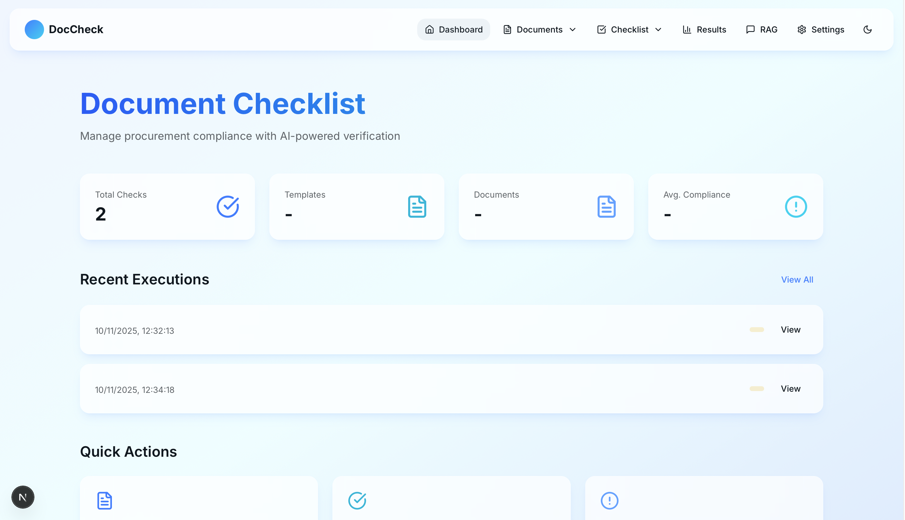
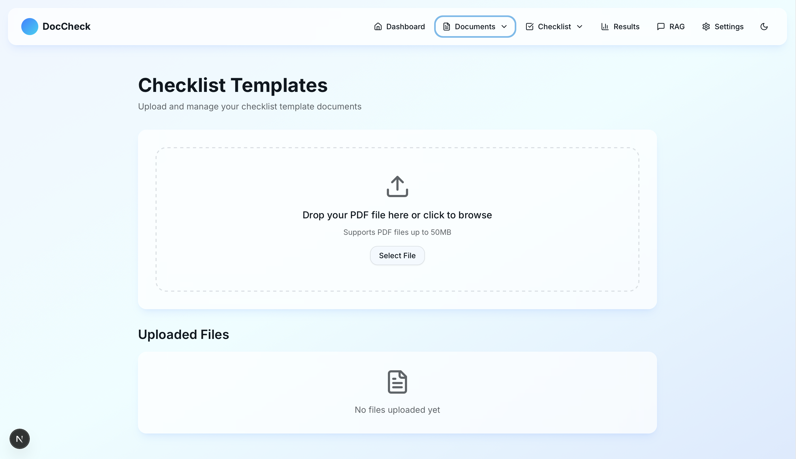
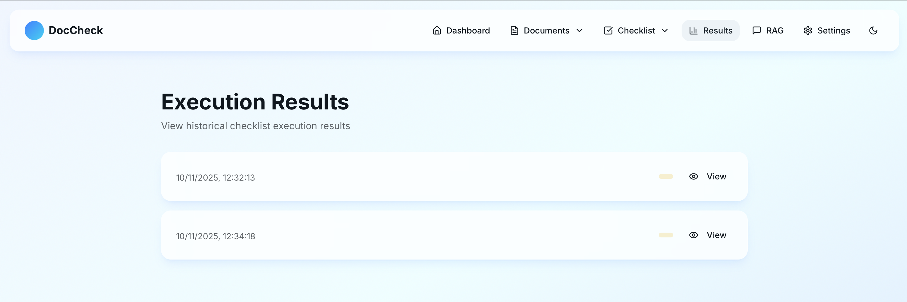

# CheckList Test Project

A full-stack application for intelligent document analysis with customizable checklists and RAG (Retrieval-Augmented Generation) capabilities. Upload documents, create custom questions and conditions, and extract structured information using Claude Sonnet 4.5.

**Features a modern glassmorphism UI design with liquid frosted glass effects, providing an elegant and immersive user experience.**

## ✨ Key Features

### Core Functionality
- 📄 **Document Upload & Processing**: Drag-and-drop interface for PDF document uploads
- ✅ **Custom Checklist Management**: Create questions and conditions for document analysis
- 🤖 **AI-Powered Extraction**: Leverage Claude Sonnet 4.5 for intelligent information extraction
- 🔍 **Vector Search**: Semantic search powered by Weaviate vector database
- 🌍 **Multi-Language Support**: Supports German and English documents
- 🎯 **Compliance Evaluation**: Automatically evaluate documents against custom conditions
- 📊 **Results Dashboard**: View extracted information and compliance status

### Modern UI/UX Design
- 🎨 **Glassmorphism Design**: Liquid frosted glass effects throughout the interface
- 🌙 **Dark Theme**: Sophisticated black, gray, and white color scheme
- ✨ **Smooth Animations**: Fluid transitions and interactive hover effects
- 📱 **Responsive Layout**: Optimized for desktop and mobile devices
- 🎯 **Intuitive Navigation**: Clean and user-friendly interface design

## Tech Stack

### Frontend
- **Framework**: Next.js 14 with TypeScript
- **Styling**: Tailwind CSS with custom glassmorphism utilities
- **Design System**: Modern dark theme with liquid frosted glass effects
- **State Management**: React Hooks
- **HTTP Client**: Axios
- **Deployment**: Vercel

### Backend
- **Framework**: FastAPI (Python)
- **AI Models**: Anthropic Claude Sonnet 4.5
- **Vector Database**: Weaviate for semantic search
- **Package Management**: uv (fast Python package installer)
- **Document Processing**: PyPDF2 for PDF parsing
- **Deployment**: Modal (serverless)
- **Local Development**: Uvicorn

## Project Structure

```
CheckList_Test/
├── frontend/           # Next.js frontend application
│   ├── src/
│   │   ├── app/       # Next.js app directory
│   │   ├── lib/       # Utilities and API client
│   │   └── types/     # TypeScript type definitions
│   └── public/        # Static assets
├── backend/           # FastAPI backend application
│   ├── src/
│   │   ├── routes/    # API routes
│   │   ├── pipelines/ # Data processing pipelines
│   │   ├── services/  # Business logic services
│   │   └── utils/     # Utility functions
│   └── pyproject.toml # Python dependencies
└── data/              # Local development data storage
```

## 📸 Screenshots

### Main Dashboard
The main dashboard features a glassmorphism design with gradient text effects and frosted glass cards.



### Document Upload Page
Drag-and-drop interface with real-time file preview and glass-styled upload zones.



### Analysis Results
View extracted information and compliance evaluation results with detailed insights.



## 🚀 Getting Started

### Prerequisites

Before you begin, ensure you have the following installed:

- **Node.js 18+** and npm (for frontend development)
- **Python 3.11+** (for backend development)
- **uv** - Fast Python package installer ([installation guide](https://github.com/astral-sh/uv))
  ```bash
  # macOS/Linux
  curl -LsSf https://astral.sh/uv/install.sh | sh
  
  # Windows
  powershell -c "irm https://astral.sh/uv/install.ps1 | iex"
  ```

### API Keys Required

- **Anthropic API Key**: For Claude Sonnet 4.5 ([get here](https://console.anthropic.com/))
- **Weaviate Instance**: Cloud or local ([get started](https://weaviate.io/developers/weaviate))
  - Option 1: Weaviate Cloud Service (WCS) - Free tier available
  - Option 2: Local Docker instance

### Quick Start

1. **Clone the repository**
   ```bash
   git clone <repository-url>
   cd CheckList_Test
   ```

2. **Set up environment variables**
   ```bash
   # Backend environment variables
   cd backend
   cp .env.example .env
   # Edit .env and add your API keys
   ```

3. **Start the backend**
   ```bash
   cd backend
   uv run uvicorn src.main:app --reload --port 8000
   ```

4. **Start the frontend** (in a new terminal)
   ```bash
   cd frontend
   npm install
   npm run dev
   ```

5. **Access the application**
   - Frontend: http://localhost:3000 (or http://localhost:3001 if 3000 is in use)
   - Backend API: http://localhost:8000
   - API Documentation: http://localhost:8000/docs

### Detailed Setup Instructions

#### Backend Setup

1. **Navigate to backend directory**
   ```bash
   cd backend
   ```

2. **Create environment file**
   ```bash
   touch .env
   ```

3. **Configure environment variables** (edit `.env`):
   ```env
   # Anthropic API Configuration
   ANTHROPIC_API_KEY=your_anthropic_api_key_here
   ANTHROPIC_MODEL=claude-sonnet-4-20250514
   
   # Weaviate Configuration
   WEAVIATE_URL=your_weaviate_cluster_url
   WEAVIATE_API_KEY=your_weaviate_api_key
   
   # Local Storage
   LOCAL_STORAGE_PATH=./data
   ```

4. **Install dependencies and run**
   ```bash
   # uv will automatically create a virtual environment and install dependencies
   uv run uvicorn src.main:app --reload --port 8000
   ```

   The backend will be available at:
   - API: `http://localhost:8000`
   - Interactive API docs: `http://localhost:8000/docs`
   - Alternative docs: `http://localhost:8000/redoc`

#### Frontend Setup

1. **Navigate to frontend directory**
   ```bash
   cd frontend
   ```

2. **Install dependencies**
   ```bash
   npm install
   ```

3. **Configure API endpoint** (optional)
   
   The frontend is configured to use `http://localhost:8000` by default. If you need to change this:
   ```bash
   # Edit src/lib/api.ts and update the baseURL
   ```

4. **Start development server**
   ```bash
   npm run dev
   ```

   The frontend will be available at `http://localhost:3000` or `http://localhost:3001`

## 🔧 Configuration

### Backend Environment Variables

Create a `.env` file in the `backend/` directory:

| Variable | Description | Required | Example |
|----------|-------------|----------|----------|
| `ANTHROPIC_API_KEY` | Your Anthropic API key for Claude | Yes | `sk-ant-...` |
| `ANTHROPIC_MODEL` | Claude model to use | Yes | `claude-sonnet-4-20250514` |
| `WEAVIATE_URL` | Weaviate cluster URL | Yes | `https://xxx.weaviate.network` |
| `WEAVIATE_API_KEY` | Weaviate API key | Yes | `xxx` |
| `LOCAL_STORAGE_PATH` | Local file storage path | No | `./data` (default) |

### Frontend Configuration

The frontend uses the backend API at `http://localhost:8000` by default. No additional environment variables are required for local development.

## 📖 How It Works

1. **Upload Documents**: Upload PDF documents through the web interface
2. **Create Checklists**: Define custom questions and conditions for your use case
3. **Run Analysis**: Select a checklist and document to analyze
4. **View Results**: Get AI-extracted answers and compliance evaluation

### Example Use Cases

- **Contract Review**: Extract key terms, dates, and verify compliance conditions
- **Document Validation**: Check if documents meet specific requirements
- **Information Extraction**: Pull structured data from unstructured documents
- **Multi-Language Processing**: Analyze documents in German or English

## Deployment

### Frontend (Vercel)

1. Push your code to GitHub
2. Connect your repository to Vercel
3. Set environment variables in Vercel dashboard
4. Deploy automatically on push

### Backend (Modal)

```bash
cd backend
modal deploy src/modal_app.py
```

## 🧪 Testing

### Backend Tests

```bash
cd backend

# Run all tests
uv run pytest

# Run specific test file
uv run pytest tests/test_german_examples.py -v

# Run with coverage
uv run pytest --cov=src
```

### Frontend Testing

```bash
cd frontend

# Lint check
npm run lint

# Type check
npm run type-check
```

## 🛠️ Development

### Project Structure Details

```
backend/
├── src/
│   ├── main.py              # FastAPI application entry point
│   ├── routes/              # API endpoints
│   │   ├── files.py         # File upload/management
│   │   ├── checklist.py     # Checklist CRUD operations
│   │   └── rag.py           # RAG query endpoint
│   ├── services/            # Business logic
│   │   ├── claude.py        # Claude AI integration
│   │   ├── embeddings.py    # Vector embeddings
│   │   ├── storage.py       # Local file storage
│   │   └── vector_db.py     # Weaviate operations
│   └── models/              # Data models
│       └── checklist.py     # Pydantic models
├── tests/                   # Test files
└── data/                    # Local storage (gitignored)

frontend/
├── src/
│   ├── app/                 # Next.js pages
│   │   ├── page.tsx         # Home page
│   │   ├── upload/          # File upload page
│   │   ├── checklist/       # Checklist management
│   │   └── settings/        # Settings page
│   ├── lib/
│   │   └── api.ts           # API client
│   └── types/
│       └── index.ts         # TypeScript definitions
└── public/                  # Static assets
```

### Adding New Features

1. **New API Endpoint**: Add route in `backend/src/routes/`
2. **New Service**: Create service in `backend/src/services/`
3. **Frontend Page**: Add page in `frontend/src/app/`
4. **API Integration**: Update `frontend/src/lib/api.ts`

## License

MIT